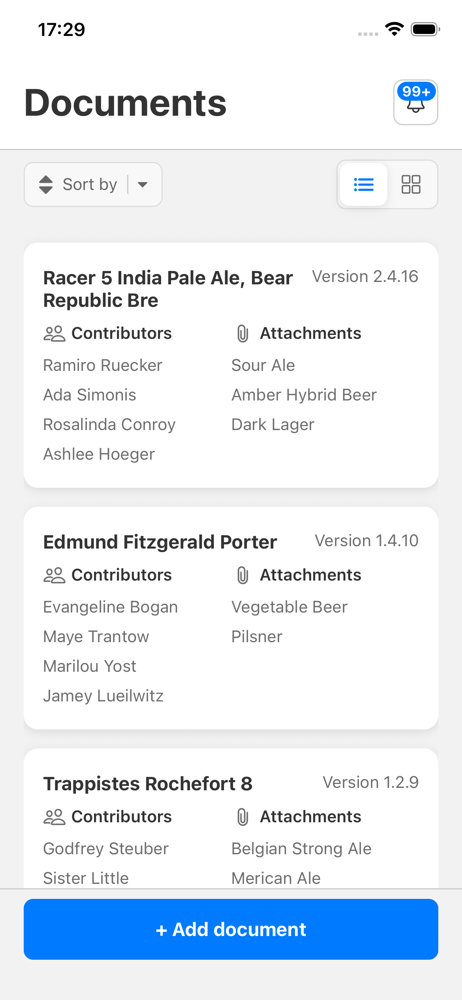
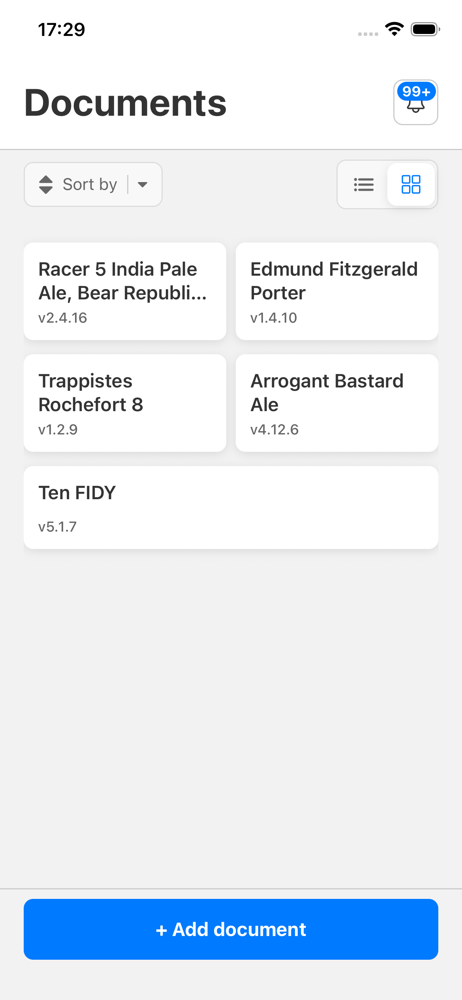
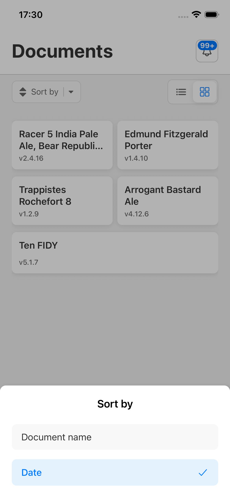
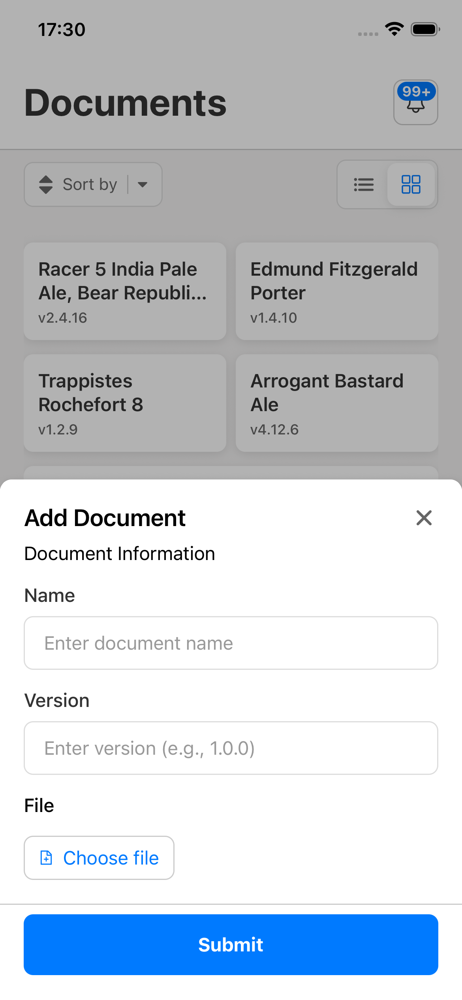
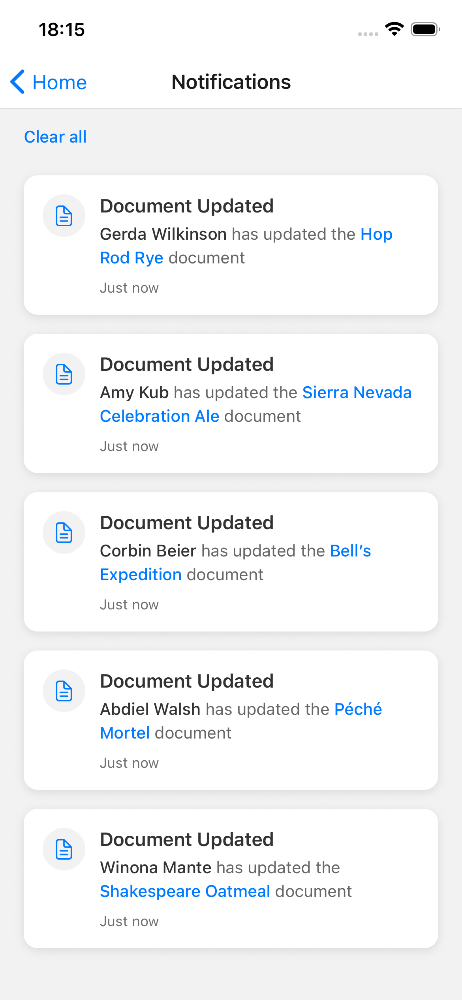

# iFile - Document Management App

This is the documentation for the App. It includes technical documentation and the reasons of some decisions. Also what could be improved.

## Features

- **Document listing**: List of documents
- **Document add form**: Form to add a new Document (not connected to API)
- **Document sorting and view mode**: Toggle between list and grid view. Also sort by date and document name
- **Real-time Notifications**: WebSocket integration for live notifications. Notifications are saved locally, so will still be the same after restarting the app.
- **Notifications screen**: List of notifications, whith the ability to clear them
- **Pull to refresh**: Pull to refresh the list of documents.
- **Internationalization**: Multi-language support with i18next. Only english has been added
- **Toast Notifications**: User feedback for actions and errors
- **Error monitoring**: Sentry integration to monitor logs and performance

## App screenshots

<div style="display: flex; flex-wrap: wrap; gap: 10px;">
  
  
  
  
  
</div>

## Disclaimers

The app should work fine on both android and ios, but has only been tested on ios because of limited hardware

There is a warning about needing to use the new SafeAreaViewContext library instead of the React Native one, the new one is already being used, probably the warning comes from a dependency version, i haven't taken the time to fix this.

## Tech Stack

- **Framework**: React Native 0.81.4 with Expo SDK 54
- **Language**: TypeScript
- **Network State Management**: TanStack Query (React Query)
- **State Management**: Zustand
- **Form Handling**: React Hook Form
- **Navigation**: React Navigation
- **Animations**: React Reanimated
- **Testing**: Jest + React Native Testing Library

## Project Structure

```
src/
├── api/ # API layer and HTTP clients
├── assets/ # Static assets and localization
│ └── localization/
│ └── translations/ # i18n translation files
├── components/ # Reusable UI components
│ └── tests/ # Component tests
├── constants/ # App constants and theme
│ └── theme.ts # Design system constants
├── hooks/ # Custom React hooks
├── navigation/ # Navigation configuration
├── screens/ # Screen components
├── services/ # External services (WebSocket, etc.)
├── stores/ # State management stores
├── types/ # TypeScript type definitions
│ └── tests/ # Type tests
└── utils/ # Utility functions
└── tests/ # Utility tests
```

In a bigger project i would add a feature approach for the structure. This means that inside of src would bee a `feature` folder. Inside the same structure as now wold appear: `components`, `hooks` etc...
This would help the project organization and make easier to find files, components etc...

## Design System

The app uses a comprehensive design system built on a 4px grid:

### Spacing Units

```typescript
UNIT = {
  XS: 4,
  SM: 8,
  MD: 12,
  LG: 16,
  XL: 20,
  XXL: 24,
  XXXL: 32,
};
```

### Color Palette

- **Primary**: Blue color scheme
- **Backgrounds**: Multi-level background hierarchy
- **Text**: Primary, secondary, and tertiary text colors
- **Borders**: Consistent border colors across components

### Typography

- **Font Sizes**: XS (12px) to XXL (24px)
- **Font Weights**: Light (300) to Bold (700)
- **Consistent line heights**: Based on 4px grid

## Getting Started

### Prerequisites

- Node.js 23.7 or higher
- npm or yarn
- Expo CLI
- iOS Simulator (for iOS development)
- Android Studio (for Android development)

To enable automatic version switching:

- If using nvm: Run nvm use when entering the project folder,
  or add auto-switching to your shell profile
- If using fnm: It should automatically switch when you cd
  into the folder
- If using volta: Run volta pin node@23.7 to configure
  automatic switching

### Installation

1. **Clone the repository**

   ```bash
   git clone <repository-url>
   cd ifile
   ```

2. **Install dependencies**

   ```bash
   npm install
   ```

3. **Set up environment variables**

   ```bash
   cp .env.example .env
   ```

   Configure your `.env` file:

   ```env
   EXPO_PUBLIC_API_BASE_URL=http://localhost:8080
   EXPO_PUBLIC_SENTRY_DSN= //Not needed to run the app
   ```

4. **Start the development server**

   ```bash
   npm start
   ```

   This will run the App in Expo Go. If a proper build is desired execute the next command after this one (stop the execution after the QR code appears)

5. **Run the app on ios device/simulator**
   ```bash
   npm run ios
   ```

### Available Scripts

- `npm start` - Start Expo development server
- `npm run android` - Run on Android emulator/device
- `npm run ios` - Run on iOS simulator/device
- `npm run web` - Run on web browser
- `npm run lint` - Run ESLint
- `npm run lint:fix` - Fix ESLint issues automatically
- `npm test` - Run Jest tests
- `npm test:watch` - Run tests in watch mode

## Testing

The project includes comprehensive testing:

```bash
# Run all tests
npm test

```

## Troubleshooting

### Common Issues

1. **Metro bundler issues**

   ```bash
   npx expo start --clear
   ```

2. **Environment variables not loading**
3. - Restart the development server after changes, clean cache, remove ios folder and remove node modules

4. **Type checking errors**

   ```bash
   npx tsc --noEmit
   ```

5. **ESLint errors**
   ```bash
   npm run lint:fix
   ```

## Why Expo and not just React Native?

Multiple reasons:

1. React native team recommends it by default
2. I'm used to work with it, this way i could "make it work" faster
3. Adds some interesting features that can be usefull: expo go etc...

## Why certain libraries are used?

1. React Query: a standard, helps with caching, refetching, error handling etc...
2. React Hook Form: makes very easy to handle form inputs, errors, form state. Also a standard.
3. React Reanimated: a standard, makes adding animations really easy. Also i'm used to it.
4. React navigation: despite the app not having any navigation, it adds a base for future features and screens that could be added in the future.
5. React Native Actions Sheet: i wanted to use an existent library to implement the modal view. Implementing from scratch with a proper performance and extensability would be very time consuming.
6. Expo Vector Icons: as i didn't have access to the app assets, i wanted to have icons in a quick way. In a real environment only needed icons and assets would be added to the app.
7. i18: it's a standard for app localization
8. React native toast message: i also didn't want to spend much time in this part (as with the action sheet), as it can be time consuming and was not required in the description.
9. React Native async storage/Zustand: i started using async storage for storing the Notifications locally. First i didn't build a notifications screen, so this approach was working well enough. After adding the screen, the state management got more complicated, so i decided to use zustand to simplify it and also store the notifications locally with it's built in feature.
10. React native document picker: is the recommended from expo documentation to handle native document selection.

## Future improvements:

1. Also add offline mode for the documents list (same as for the notifications)
2. Improve the testing part. Snapshot tests could be added. Also E2E tests. Also some features don't have tests as i added them later on (it was not planned), for example the notifications screen.
3. With time i would have also deployed the app, maybe just to Firebase App distribution.
4. The styling could also be improved. With a proper design system from a designer would improve a lot.
5. Add icon, splash screen etc... I didn't add it because of time and also wouldn't add
6. As i didn't have a figma file (or similar), the design is not pixel perfect. Also i have used different icons, colors etc...

## Was AI used to implement this project?

The simple and honest answer is yes. I have worked in this project in the same way i would work in my job. Maybe i have used AI a bit more due to time limitations. Also i think AI is already very deep in our sector, so makes no sense to not use the tools we usually use. Also i have taken the chance to use and try tools that i haven't used before (Claude Code).

### How has AI being used?

Mostly to create documentation, tests and refactorings.

Because of limited time i have taken a "make it work first" approach. This way I built a skeleton with the main and critical features. After that continued with refactoring. For example i didn't have a proper design system with constants at the beginning. After that the testing part. Testing takes quite some time to get configured properly, that's why i have used AI in this part.

### Development flow?

I have used a real case flow. Create new branches for each feature, open PR, then merge to main branch.

I have also used squash when mergin. In my opinion it gives a better and more clean commit history in the main branch. If more atomic commits need to be checked, they can be checked in the PRs.
